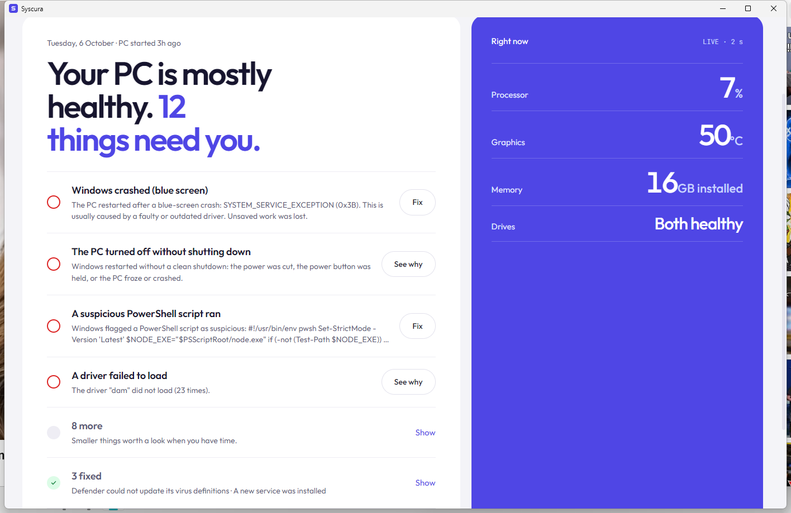
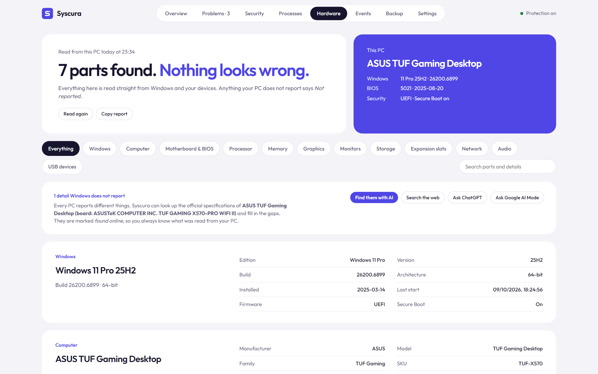
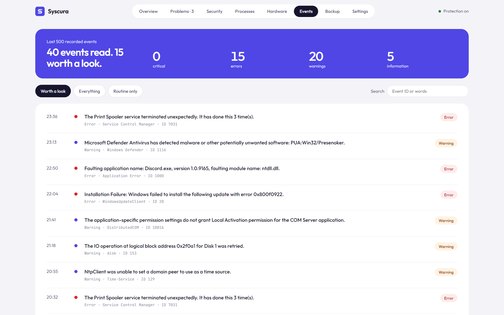
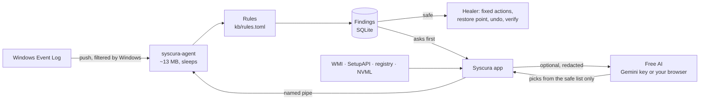

<div align="center">

<picture>
  <source media="(prefers-color-scheme: dark)" srcset="docs/syscura-logo-on-dark.svg" />
  
</picture>

### Your PC's doctor and bodyguard, in 2 MB.

Syscura watches Windows quietly in the background, tells you in plain English what every scary-looking alert actually means, fixes what it safely can, **checks whether the fix really worked**, and tells you honestly when it didn't.

Free. Open source. No account, no ads, no telemetry, nothing to pay for.

[](https://github.com/hiibrarahmad/syscura/releases)
[](https://github.com/hiibrarahmad/syscura/actions/workflows/ci.yml)
[](LICENSE)


[**Download Syscura**](https://github.com/hiibrarahmad/syscura/releases/latest) · [What it finds](#what-it-finds) · [Free AI help](#free-ai-help-no-key-needed) · [How fixes stay safe](#how-fixes-stay-safe) · [Build from source](#build-from-source)

</div>

<p align="center">
  
</p>

---

## Why Syscura?

Windows logs thousands of warnings. Most are noise, a few really matter, and almost none are explained. Syscura sorts them out for you.

| | |
|---|---|
| 🩺 **Explains every alert** | "Windows crashed (blue screen): SYSTEM_SERVICE_EXCEPTION, usually a faulty driver." Every problem says **what happened**, **whether it is harmful** (yes / maybe / no) and **what to do**. Harmless noise (hello, DCOM 10016) is labelled as safe to ignore. |
| 🛠️ **Fixes without breaking things** | Safe fixes (restart a crashed service, update Defender, sync the clock) run by themselves. Anything that changes your PC asks first, makes a restore point, and records an **Undo**. Nothing is ever deleted. |
| ✅ **Honest about results** | If SFC finds nothing to repair, Syscura says *"found nothing wrong, so it was not the cause"* instead of pretending it fixed something. After any fix, the AI reads the result and tells you **Fixed / Not fixed** and what to try next. |
| ✦ **Free AI help, no key needed** | One click opens **ChatGPT, Claude, Copilot, Gemini or Google AI Mode** in your browser with the problem already written out (private details removed). Or add a free Gemini key and Syscura searches the web, explains, and picks fixes from its safe list. |
| 🕵️ **Catches what antivirus misses** | A light **live process watch** flags fake Windows processes (an `svchost.exe` outside System32), unsigned programs running from Temp, Downloads or AppData, and Office or PDF readers starting PowerShell. A scan of **everything that starts with Windows** (Run keys, Startup folders, scheduled tasks) flags unsigned programs and hidden or downloading scripts. Brand-new malware has no signature yet, but it still has to run and stay running. |
| 🔐 **Security score** | The **Security** page checks Windows' own protection: firewall, Defender, User Account Control, Windows updates, old SMBv1 sharing, Remote Desktop, Secure Boot, Microsoft's vulnerable driver blocklist, BitLocker and LSA protection. You get a score out of 100, plain words for each check, and a one-click fix where there is a safe one. It also lists **programs with updates** (through winget). |
| 🪤 **Deeper malware checks** | Debugger hijacks (including the sign-in-screen backdoor), a replaced Windows shell, AppInit DLLs, hidden WMI tasks, unsigned services in user folders, a hosts file that blocks security sites or redirects your bank, proxies, unknown DNS servers, force-installed browser extensions, and **drivers with known security holes** (LOLDrivers list, shipped offline). |
| 🧯 **Ransomware tripwire** | Optional. A hidden file in Documents and Pictures is checked every 5 seconds; if anything encrypts or renames it, you are warned at once, while there is still time to unplug. |
| 🗂️ **Every process, live** | The **Processes** page lists every running program with CPU, memory, folder, publisher and signature, and marks anything suspicious. Open its folder, scan it with Defender, or stop it (asks first). |
| 🔄 **Updates itself, safely** | Finds new releases on GitHub and installs one only if its checksum list carries **Syscura's own signature** and the download matches it. Keeps all your data. Installing again or over an old portable copy never creates a second Syscura. |
| 🧠 **Remembers** | Press **Mark as safe** once and Syscura never warns about that thing again. If a problem returns after a fix that worked, Syscura applies the same fix again. |
| 🛡️ **Warns you and protects your files** | Serious problems (virus found, failing drive, repeated blue screens) show a red banner and a Windows notification, with a **Back up my files now** button that copies your folders to another drive. Backups can **repeat by themselves** (every few days, only changed files), and drive health is **tracked daily** so a drive wearing out fast is caught early. |
| 🔬 **Accurate hardware, any PC** | Runs natively on **x64 and ARM64** (Snapdragon) Windows, with graphics load for any GPU maker. Read fresh at every start from Windows itself: exact Windows 11 version and build, board and BIOS, CPU, every RAM stick's part number, GPU, drives with health and wear, monitors, battery wear, network, USB. Anything your PC doesn't report says *Not reported*. No guessing. |
| 🪶 **Tiny** | The background agent uses **~13 MB of RAM and 0% CPU when idle**. It sleeps until Windows reports something. The window only runs while you look at it. |

<p align="center">
  
</p>

## Download

> [!TIP]
> Something odd on your PC, or a detail Syscura gets wrong? Please [report it](https://github.com/hiibrarahmad/syscura/issues/new/choose); every report makes Syscura better for people with the same hardware.

### Install (recommended)

**With winget** (no SmartScreen warning), once Syscura is in the winget catalogue:

```powershell
winget install IbrarAhmad.Syscura
```

**Or download the Setup:**

1. Download **`Syscura-<version>-setup.exe`** from [**Releases**](https://github.com/hiibrarahmad/syscura/releases/latest) (`-setup-arm64.exe` for ARM PCs such as Snapdragon laptops).
2. Double-click it. Until Syscura's code signing is approved, Windows SmartScreen may warn you the first time. Click **More info → Run anyway**, then **Yes** on the admin prompt. (Why, and what is being done about it: [docs/code-signing.md](docs/code-signing.md).)
3. Click **Next → Install → Finish**. That's it:
   - Syscura is installed in `C:\Program Files\Syscura`, with a Start menu entry and an uninstaller in *Settings → Apps*.
   - **Background protection is set up as a Windows service** and starts with Windows, before anyone signs in.
   - **The Syscura icon sits in the taskbar tray** (the **^** next to the clock) after every restart. Click it to open Syscura, right-click for the menu. Closing the window keeps it there.
   - Serious problems pop up as Windows notifications, even when the window is closed.

**Updates are built in.** Syscura checks GitHub once a day and tells you when a new version is out. *Settings → Updates → Download and install* fetches it, checks Syscura's signature on the release's checksums and the download's SHA-256, installs it over your copy and opens Syscura again. Your history, "marked safe" verdicts, settings and AI key are kept. Running a newer Setup by hand works too. To remove Syscura, use *Settings → Apps → Syscura → Uninstall*: the service and auto-start are removed too. (Your history in `C:\ProgramData\Syscura` is kept; delete that folder for a clean slate.)

### Portable (no install)

Prefer not to install? Download `Syscura-<version>-windows-x64.zip` (or `-arm64.zip`), unzip it anywhere, run **Syscura.exe** and press **Start**. Protection then runs until you sign out. **Install as a Windows service** in Settings makes it permanent; it copies Syscura to Program Files first, because a service running with full system rights must not live in a folder every program can change.

You can check any download against the release:

```powershell
Get-FileHash .\Syscura-<version>-setup.exe -Algorithm SHA256   # compare with SHA256SUMS.txt
```

Requirements: Windows 10 or 11, 64-bit (x64 or ARM64), any PC or laptop. WebView2 is part of Windows 11; on Windows 10 the installer adds it if it is missing. Every release is tested automatically on clean Windows machines: the hardware scan and the agent on Windows Server 2022 and 2025, and the full install, service start and uninstall on Windows Server 2022 and on Windows 11 ARM64.

## What it finds

Syscura's knowledge base lives in [`kb/rules.toml`](kb/rules.toml): 47 plain, reviewable rules, not hidden code.

| Area | Examples |
|---|---|
| **Security** | Debugger hijacks and sign-in-screen backdoors · replaced Windows shell · AppInit DLLs · hidden WMI tasks · vulnerable or malicious drivers · hosts-file tampering · proxies and unknown DNS servers · forced browser extensions · ransomware tripwire · fake Windows processes · unsigned programs and services in user folders · documents starting command shells · unsigned or script-based startup items · Defender found a threat · real-time protection turned off · virus definitions failing to update · a new service or driver installed (checked for a valid signature and a suspicious location) · an event log was cleared · suspicious PowerShell |
| **Software** | Services crashing or failing to start · programs crashing or hanging · **blue screens with the stop code decoded** (0x3B → SYSTEM_SERVICE_EXCEPTION, usually a driver) · drivers failing to load · Windows Update failing |
| **Hardware** | Corrected and fatal hardware errors (WHEA) · unexpected power loss |
| **Storage** | Disk read/write errors · NTFS damage · low disk space · drive wear rising fast · drive near end of life · drive running hot · health getting worse |
| **Network** | DNS timeouts · clock sync failures |
| **Noise** | Messages Windows logs on every PC that mean nothing. Shown as *safe to ignore*. |

On first start Syscura also reads the **last 7 days** of history, so you see existing problems right away. The **Events** page shows every recorded event with Windows' own message, and lets you ask the AI about any of them.

<p align="center">
  
</p>

## Free AI help (no key needed)

Every problem and every event has a help row:

- **Search the web** opens Google with the exact error, stop code or event ID.
- **Ask ChatGPT / Claude / Copilot / Google AI Mode** opens that site in your browser with the full question already filled in. Use your normal free account. For **Gemini**, the question is copied and you paste it.
- **Ask AI** inside the app (optional): add a free Gemini key in Settings (sign in at [aistudio.google.com/apikey](https://aistudio.google.com/apikey), no card needed). Syscura then searches the web with Google, explains the problem, rates the harm, and suggests fixes **only from its own safe list**.
- **AI fix check:** when a fix finishes (SFC, DISM, a Defender scan, a service restart...), Syscura asks the AI whether that result means the problem is fixed. You see **Fixed**, **Not fixed** or **Not sure**, plus the next step. Without a key, **Ask Google AI if it worked** sends the same question to your browser.
- **Automatic mode** (optional, off by default): new problems are explained and their *safe* fixes applied while the app is open. At most 20 AI questions a day, so it stays inside the free limit. When the newest model's free limit is used up, Syscura falls back to the next free model by itself.

**Privacy:** before anything is sent, your user name, PC name, user-folder paths, e-mail and IP addresses are masked. The key is stored in Windows Credential Manager. The AI never runs commands: it can only pick actions from Syscura's fixed list, and the agent re-checks every pick.

## How fixes stay safe

Syscura can only do things on a short, fixed list of 19 actions. A rule or the AI can *choose* an action; neither can run an arbitrary command.

- **Nothing is deleted.** Folders are renamed or moved to quarantine, settings are remembered.
- **Undo** for every change that can be reversed (a disabled service gets its old start type back, Windows Update's cache is renamed back, print jobs come back).
- **Safe, Asks first, Risky.** Only *safe* fixes run on their own: at most 6 an hour, never for old events, and a fix that failed twice is not retried. The agent, not the app or the AI, decides what counts as safe.
- **A restore point first** before anything that is not safe (when Windows allows one).
- **Verified, honestly.** After a fix Syscura checks it worked: is the service really running, did the problem stay away? Repair tools are read properly. *"Found nothing wrong"* and *"could not repair"* keep the problem open, with a **What next** box (next fix, AI check, web search).
- **Microsoft's own tools.** Repairs use `sfc`, `DISM`, `chkdsk` (read-only scan), Defender's `MpCmdRun` and the Service Control Manager, always by full System32 path.
- **Windows components are off-limits** for anything like disabling.

## Backup

The **Backup** page copies Desktop, Documents, Pictures (and anything else you tick) to another drive or a USB stick, into `Syscura Backup\<date>`. It only **copies**: it never deletes, moves or overwrites anything in your folders. It warns you if you pick the drive Windows is on. When a problem puts your files at risk, Syscura offers this first.

## Command line

```text
syscura-cli status                 agent health and memory use
syscura-cli problems [--all]       what Syscura found, what it tried, and the result
syscura-cli fix <problem> <fix>    run a fix
syscura-cli undo <attempt>         undo a fix
syscura-cli ignore <problem>       hide a problem
syscura-cli hw [--refresh]         hardware inventory
syscura-cli events [-n N]          raw events
```

The agent itself: `syscura-agent run` (in a console), `syscura-agent install` / `uninstall` (Windows service, admin).

## How it works



| Crate | Job |
|---|---|
| `syscura-agent` | Background service: event subscriptions, rules, healer, local named pipe |
| `syscura-rules` | Knowledge-base engine (thresholds, grouping, explanations) |
| `syscura-store` | SQLite log of events, findings and fix attempts |
| `syscura-sensors` | Push-based Event Log sensor, history reader, Windows' own messages |
| `syscura-hw` | Hardware inventory: Windows version, board, CPU, RAM, slots, GPU (NVML), drives, monitors, battery, network, USB |
| `syscura-online` | Free Gemini client with model fallback, privacy redaction, web prompts, Credential Manager key storage |
| `ui/` | Tauri + Svelte desktop app (Verdict design) |

## Privacy

Syscura has no accounts, no telemetry and no ads. It only connects to the internet in these cases:

- **Update check:** once a day it asks GitHub for the latest version number. Nothing about your PC is sent. You can turn this off in *Settings → Updates*.
- **AI help, when you use it:** the problem's text and a one-line hardware summary go to Google Gemini (with your own key), with your name, PC name, folder paths, e-mail and IP addresses masked first. The browser buttons open the AI site you choose.
- **Program updates, when you ask:** the Security page runs Windows' own winget, which contacts Microsoft's package catalogue.

Everything else (events, problems, hardware, drive history) stays on your PC in `C:\ProgramData\Syscura`.

## Code signing policy

Free code signing provided by [SignPath.io](https://about.signpath.io), certificate by [SignPath Foundation](https://signpath.org) *(application in progress; until it is approved, releases are unsigned)*.

- Releases are built only by GitHub Actions ([`release.yml`](.github/workflows/release.yml)) from this repository's source code.
- Committers and reviewers: [Ibrar Ahmad (@hiibrarahmad)](https://github.com/hiibrarahmad). Approver of each release signing: Ibrar Ahmad.
- Every release's checksum list is also signed with Syscura's own update key, and the app checks that signature before installing an update.

Details: [docs/code-signing.md](docs/code-signing.md).

## Build from source

You need Rust (stable, MSVC toolchain), the Visual Studio C++ Build Tools and Node.js 20+.

```powershell
git clone https://github.com/hiibrarahmad/syscura
cd syscura
cd ui; npm ci; npm run build; cd ..
cargo test --workspace
powershell -ExecutionPolicy Bypass -File scripts\build-release.ps1            # -Arch arm64 for ARM PCs
# dist\Syscura-<version>-setup.exe, the portable zip and SHA256SUMS.txt
cargo deny check                                                            # dependency security and licenses
```

## Roadmap

- [x] Event-driven agent, knowledge base, safe fixes with undo and verification
- [x] Accurate hardware report for any PC or laptop, exact Windows 11 version
- [x] Free AI help: in-app with a free Gemini key, or any AI website with no key
- [x] AI check after every fix, honest "found nothing" results, web search per problem
- [x] Warnings, notifications and one-click backup for serious problems
- [x] Live process watch: unsigned programs in Temp/Downloads, fake system processes, Office starting PowerShell
- [x] Tray icon, installer, signed auto-update
- [x] Security score, deeper malware checks, vulnerable drivers, ransomware tripwire
- [x] Drive health over time, repeating backups, weekly summary, Windows on ARM
- [ ] Code signing through SignPath Foundation (applied), winget catalogue
- [ ] CPU temperature and board voltages through a free, signed driver
- [ ] Linux, then macOS

## Contributing

The easiest ways to help:

- **Wrong hardware info?** Press **Copy report** on the Hardware page and open a [hardware info report](https://github.com/hiibrarahmad/syscura/issues/new?template=hardware_info.yml). Every report makes Syscura more accurate for people with the same PC.
- **Improve a rule.** Found a false alarm or a missed problem? Open a [false-alarm report](https://github.com/hiibrarahmad/syscura/issues/new?template=false_alarm.yml) or edit [`kb/rules.toml`](kb/rules.toml).
- **Bugs and ideas** go through the [issue forms](https://github.com/hiibrarahmad/syscura/issues/new/choose) or [Discussions](https://github.com/hiibrarahmad/syscura/discussions).

See [CONTRIBUTING.md](CONTRIBUTING.md) for setup and guidelines.

## FAQ

**Is this an antivirus?** No. Syscura works *with* Microsoft Defender: it surfaces what Defender found, notices when protection is switched off, and adds checks Defender does not show you (new services, wiped logs, hijacked startup settings, vulnerable drivers).

**Why does Windows warn when I install it?** The files are not code-signed yet. Free signing for open-source projects (SignPath Foundation) has been applied for; until then, install through winget or click *More info → Run anyway*. See [docs/code-signing.md](docs/code-signing.md).

**Will it slow my PC?** No. The agent waits for Windows to push events and does nothing in between: ~13 MB RAM, 0% CPU when idle.

**Do I need an AI account or key?** No. Everything works without one. The browser buttons use whatever free AI site you like, and the Gemini key is optional and free.

**Does it need admin rights?** Watching and explaining: no. Most fixes: yes, which is what the optional Windows service is for.

**Does it send my data anywhere?** No telemetry, no accounts. See [Privacy](#privacy) for the few times it goes online.

---

<div align="center">

Made by **Ibrar Ahmad** · MIT licensed

[](https://github.com/hiibrarahmad)
[](https://www.linkedin.com/in/hiibrarahmad/)
[](https://hiibrarahmad.github.io/)

If Syscura helped you understand or fix your PC, a ⭐ helps others find it.

</div>
