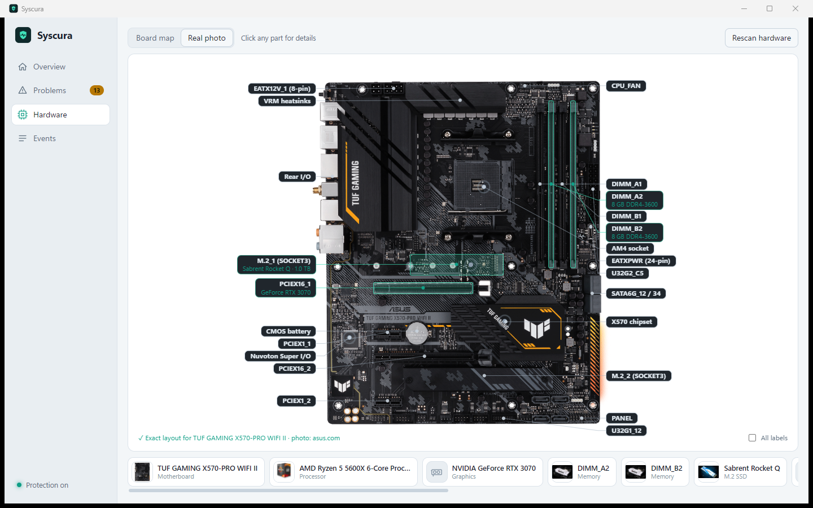
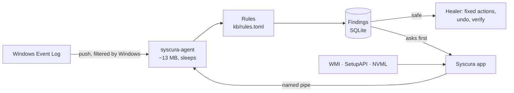

<div align="center">


# Syscura

**Your PC's doctor and bodyguard, in 2 MB.**

Syscura watches Windows quietly in the background, tells you in plain English what every scary-looking alert actually means, fixes what it safely can, and shows your hardware on a real photo of *your* motherboard.

Free. Open source. No account, no ads, no telemetry, no paid APIs.

[](https://github.com/hiibrarahmad/syscura/releases)
[](https://github.com/hiibrarahmad/syscura/actions/workflows/ci.yml)
[](LICENSE)


[**Download the beta**](https://github.com/hiibrarahmad/syscura/releases) · [What it finds](#what-it-finds) · [How fixes stay safe](#how-fixes-stay-safe) · [Build from source](#build-from-source) · [Roadmap](#roadmap)

</div>

<p align="center">
  
</p>

---

## Why Syscura?

Windows logs thousands of warnings. Most are noise; a few really matter; almost none are explained. Syscura sorts them out for you.

| | |
|---|---|
| 🩺 **Explains every alert** | "A Windows service crashed", "Defender found a threat", "the PC turned off without shutting down". Each finding says what happened, **whether it is harmful (yes / maybe / no)** and what to do. Harmless noise (hello, DCOM 10016) is labelled as noise. |
| 🛠️ **Fixes without breaking things** | Safe fixes (restart a crashed service, clear the DNS cache, update Defender) run by themselves. Anything that changes your PC asks first, makes a restore point or records an **Undo**, and is **verified** afterwards. Nothing is ever deleted. |
| 🛡️ **Watches for trouble** | Defender detections, Defender protection switched off, **newly installed services** (checked for a valid signature and a suspicious location), event logs being wiped, suspicious PowerShell. |
| 🖼️ **Your real motherboard** | Syscura recognises your board and shows the maker's own photo with **exact labels**: every DIMM, PCIe and M.2 slot, power and fan headers, SATA ports. Your installed RAM, GPU and SSD are highlighted in the exact slot they sit in. |
| 🔬 **Deep part details** | RAM part numbers decoded, voltages, ranks, running vs. rated speed (with a hint when XMP is off); GPU VBIOS, PCIe link, power limit, live temperature and clocks; drive health, wear and temperature; which USB device sits on which port. |
| 🪶 **Tiny** | The background agent uses **~13 MB of RAM and 0% CPU when idle**. It sleeps until Windows reports something. The window only runs while you look at it. |

<p align="center">
  
</p>

## Download

> [!NOTE]
> Syscura is in **public beta**. It works well on the machines it was tested on, but it is young. Please [report anything odd](https://github.com/hiibrarahmad/syscura/issues/new/choose); it really helps.

1. Download `Syscura-<version>-windows-x64.zip` from [**Releases**](https://github.com/hiibrarahmad/syscura/releases).
2. Unzip it anywhere you like to keep it (for example `C:\Program Files\Syscura`).
3. Run **Syscura.exe** and press **Start protection**.
4. Optional: press **Install as a Windows service** so protection starts with Windows and can apply fixes that need admin rights (one admin prompt).

**Windows SmartScreen will warn you** the first time, because the beta is not code-signed yet (certificates cost money; free signing for open-source projects is planned). Click *More info → Run anyway*. You can check that your download matches the release:

```powershell
Get-FileHash .\Syscura.exe -Algorithm SHA256   # compare with SHA256SUMS.txt in the release
```

Requirements: Windows 10 or 11, 64-bit. WebView2 is already part of Windows 11.

## What it finds

Syscura's knowledge base lives in [`kb/rules.toml`](kb/rules.toml): plain, reviewable data, not hidden code.

| Area | Examples |
|---|---|
| **Security** | Defender detected a threat · Defender real-time protection turned off · virus definitions failing to update · a new service installed (with signature + location check) · an event log was cleared · suspicious PowerShell |
| **Software** | Services crashing or failing to start · programs crashing or hanging · blue screens (with the stop code) · drivers failing to load · Windows Update failing |
| **Hardware** | Corrected and fatal hardware errors (WHEA) · unexpected power loss |
| **Storage** | Disk read/write errors · NTFS damage · low disk space |
| **Network** | DNS timeouts · clock sync failures |
| **Noise** | Messages Windows logs on every PC that mean nothing. Shown as harmless, hidden by default. |

On first start Syscura also checks the **last 7 days** of history, so you see existing problems right away.

## How fixes stay safe

Syscura can only do things on a short, fixed list. A rule (or, later, an AI suggestion) can choose an action; it can never run an arbitrary command.

- **Nothing is deleted.** Folders are renamed, settings are remembered.
- **Undo** for every change that can be reversed (a disabled service gets its old start type back, Windows Update's cache gets renamed back).
- **Safe, Asks first, Risky.** Only *safe* fixes run on their own: at most 6 an hour, never for old events, and a fix that failed twice is not retried.
- **Verified.** After a fix, Syscura checks it worked (is the service really running? did the problem stay away for 30 minutes?) and tells you if it didn't hold.
- **Microsoft's own tools.** Repairs use `sfc`, `DISM`, `chkdsk` (read-only), Defender's `MpCmdRun` and the Service Control Manager, always by full System32 path.
- **Windows components are off-limits** for anything like disabling.

## Privacy

Everything stays on your PC. The only network requests Syscura makes are **picture lookups** for your parts: the part name is searched on Bing Images, Brave or DuckDuckGo, or the photo is fetched straight from the maker (for example asus.com). Results are cached, so each part is looked up once. No personal data, no telemetry, no accounts.

## Command line

```text
syscura-cli status                 agent health and memory use
syscura-cli problems [--all]       what Syscura found and what it tried
syscura-cli fix <problem> <fix>    run a fix
syscura-cli undo <attempt>         undo a fix
syscura-cli ignore <problem>       hide a problem
syscura-cli hw [--refresh]         hardware inventory
syscura-cli events [-n N]          raw events
```

The agent itself: `syscura-agent run` (in a console), `syscura-agent install` / `uninstall` (Windows service, admin).

## How it works



| Crate | Job |
|---|---|
| `syscura-agent` | Background service: subscriptions, rules, healer, local named pipe |
| `syscura-rules` | Knowledge-base engine (thresholds, grouping, explanations) |
| `syscura-store` | SQLite log of events, findings and fix attempts |
| `syscura-sensors` | Push-based Event Log sensor and history reader |
| `syscura-hw` | Hardware inventory: board, CPU, RAM, slots, GPU (NVML), drives, USB ports |
| `syscura-online` | Picture finder and cache |
| `ui/` | Tauri + Svelte desktop app |

## Build from source

You need Rust (stable, MSVC toolchain), the Visual Studio C++ Build Tools and Node.js.

```powershell
git clone https://github.com/hiibrarahmad/syscura
cd syscura
cd ui; npm ci; npm run build; cd ..
cargo test --workspace
cd ui; npx tauri build --no-bundle
# binaries: target\release\syscura-ui.exe, syscura-agent.exe, syscura-cli.exe
```

## Roadmap

- [x] Event-driven agent, knowledge base, safe fixes with undo and verification
- [x] Hardware inventory, real-photo board view, part pictures
- [ ] **Live process watch**: unsigned programs in Temp/Downloads, fake system processes, Office starting PowerShell
- [ ] Tray icon and notifications
- [ ] More verified board profiles ([help wanted](https://github.com/hiibrarahmad/syscura/issues/new?template=board_profile.yml))
- [ ] CPU temperature and board voltages through a free, signed driver
- [ ] Installer, code signing, auto-update with signed rule updates
- [ ] Optional plain-language help from a free AI (your own key, never required)
- [ ] Linux, then macOS

## Contributing

The easiest ways to help:

- **Add your motherboard.** A board profile is a list of rectangles on the maker's photo. See [CONTRIBUTING.md](CONTRIBUTING.md#adding-a-board-profile).
- **Improve a rule.** Found a false alarm or a missed problem? Open a [false-alarm report](https://github.com/hiibrarahmad/syscura/issues/new?template=false_alarm.yml) or edit [`kb/rules.toml`](kb/rules.toml).
- **Report bugs and ideas** through the [issue forms](https://github.com/hiibrarahmad/syscura/issues/new/choose) or [Discussions](https://github.com/hiibrarahmad/syscura/discussions).

## FAQ

**Is this an antivirus?** No. Syscura works *with* Microsoft Defender: it surfaces what Defender found, notices when protection is switched off, and adds checks Defender does not show you (new services, wiped logs).

**Will it slow my PC?** No. The agent waits for Windows to push events and does nothing in between: ~13 MB RAM, 0% CPU when idle.

**Does it need admin rights?** Watching and explaining: no. Most fixes: yes, which is what the optional Windows service is for.

**Why does it look up pictures online?** So you see *your* parts. It only sends part names, caches the result, and you can always set your own picture.

---

<div align="center">

Made by **[Hiibrarahmad](https://github.com/hiibrarahmad)** · MIT licensed

If Syscura helped you understand or fix your PC, a ⭐ helps others find it.

</div>
