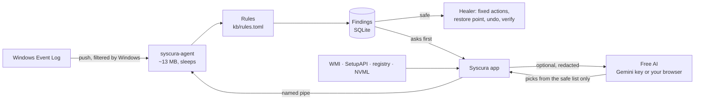

<div align="center">

<picture>
  <source media="(prefers-color-scheme: dark)" srcset="docs/syscura-logo-on-dark.svg" />
  
</picture>

### Your PC's doctor and bodyguard, in 2 MB.

Syscura watches Windows quietly in the background, tells you in plain English what every scary-looking alert actually means, fixes what it safely can, **checks whether the fix really worked**, and tells you honestly when it didn't.

Free. Open source. No account, no ads, no telemetry, nothing to pay for.

[](https://github.com/hiibrarahmad/syscura/releases)
[](https://github.com/hiibrarahmad/syscura/actions/workflows/ci.yml)
[](LICENSE)


[**Download the beta**](https://github.com/hiibrarahmad/syscura/releases/latest) · [What it finds](#what-it-finds) · [Free AI help](#free-ai-help-no-key-needed) · [How fixes stay safe](#how-fixes-stay-safe) · [Build from source](#build-from-source)

</div>

<p align="center">
  
</p>

---

## Why Syscura?

Windows logs thousands of warnings. Most are noise, a few really matter, and almost none are explained. Syscura sorts them out for you.

| | |
|---|---|
| 🩺 **Explains every alert** | "Windows crashed (blue screen): SYSTEM_SERVICE_EXCEPTION, usually a faulty driver." Every problem says **what happened**, **whether it is harmful** (yes / maybe / no) and **what to do**. Harmless noise (hello, DCOM 10016) is labelled as safe to ignore. |
| 🛠️ **Fixes without breaking things** | Safe fixes (restart a crashed service, update Defender, sync the clock) run by themselves. Anything that changes your PC asks first, makes a restore point, and records an **Undo**. Nothing is ever deleted. |
| ✅ **Honest about results** | If SFC finds nothing to repair, Syscura says *"found nothing wrong, so it was not the cause"* instead of pretending it fixed something. After any fix, the AI reads the result and tells you **Fixed / Not fixed** and what to try next. |
| ✦ **Free AI help, no key needed** | One click opens **ChatGPT, Claude, Copilot, Gemini or Google AI Mode** in your browser with the problem already written out (private details removed). Or add a free Gemini key and Syscura searches the web, explains, and picks fixes from its safe list. |
| 🛡️ **Warns you and protects your files** | Serious problems (virus found, failing drive, repeated blue screens) show a red banner and a Windows notification, with a **Back up my files now** button that copies your folders to another drive. |
| 🔬 **Accurate hardware, any PC** | Read fresh at every start from Windows itself: exact Windows 11 version and build, board and BIOS, CPU, every RAM stick's part number, GPU, drives with health and wear, monitors, battery wear, network, USB. Anything your PC doesn't report says *Not reported*. No guessing. |
| 🪶 **Tiny** | The background agent uses **~13 MB of RAM and 0% CPU when idle**. It sleeps until Windows reports something. The window only runs while you look at it. |

<p align="center">
  
</p>

## Download

> [!NOTE]
> Syscura is in **public beta**. It works well on the machines it was tested on, but it is young. Please [report anything odd](https://github.com/hiibrarahmad/syscura/issues/new/choose); it really helps.

1. Download `Syscura-<version>-windows-x64.zip` from [**Releases**](https://github.com/hiibrarahmad/syscura/releases/latest).
2. Unzip it somewhere you want to keep it (for example `C:\Program Files\Syscura`).
3. Run **Syscura.exe** and press **Start**.
4. Recommended: press **Install as a Windows service** so protection starts with Windows and can run fixes that need admin rights (one admin prompt).

**Windows SmartScreen will warn you** the first time, because the beta is not code-signed yet (certificates cost money; free signing for open-source projects is planned). Click *More info → Run anyway*. You can check your download against the release:

```powershell
Get-FileHash .\Syscura.exe -Algorithm SHA256   # compare with SHA256SUMS.txt in the release
```

Requirements: Windows 10 or 11, 64-bit. WebView2 is already part of Windows 11.

## What it finds

Syscura's knowledge base lives in [`kb/rules.toml`](kb/rules.toml): 24 plain, reviewable rules, not hidden code.

| Area | Examples |
|---|---|
| **Security** | Defender found a threat · real-time protection turned off · virus definitions failing to update · a new service or driver installed (checked for a valid signature and a suspicious location) · an event log was cleared · suspicious PowerShell |
| **Software** | Services crashing or failing to start · programs crashing or hanging · **blue screens with the stop code decoded** (0x3B → SYSTEM_SERVICE_EXCEPTION, usually a driver) · drivers failing to load · Windows Update failing |
| **Hardware** | Corrected and fatal hardware errors (WHEA) · unexpected power loss |
| **Storage** | Disk read/write errors · NTFS damage · low disk space |
| **Network** | DNS timeouts · clock sync failures |
| **Noise** | Messages Windows logs on every PC that mean nothing. Shown as *safe to ignore*. |

On first start Syscura also reads the **last 7 days** of history, so you see existing problems right away. The **Events** page shows every recorded event with Windows' own message, and lets you ask the AI about any of them.

<p align="center">
  
</p>

## Free AI help (no key needed)

Every problem and every event has a help row:

- **Search the web** opens Google with the exact error, stop code or event ID.
- **Ask ChatGPT / Claude / Copilot / Google AI Mode** opens that site in your browser with the full question already filled in. Use your normal free account. For **Gemini**, the question is copied and you paste it.
- **Ask AI** inside the app (optional): add a free Gemini key in Settings (sign in at [aistudio.google.com/apikey](https://aistudio.google.com/apikey), no card needed). Syscura then searches the web with Google, explains the problem, rates the harm, and suggests fixes **only from its own safe list**.
- **AI fix check:** when a fix finishes (SFC, DISM, a Defender scan, a service restart...), Syscura asks the AI whether that result means the problem is fixed. You see **Fixed**, **Not fixed** or **Not sure**, plus the next step. Without a key, **Ask Google AI if it worked** sends the same question to your browser.
- **Automatic mode** (optional, off by default): new problems are explained and their *safe* fixes applied while the app is open. At most 20 AI questions a day, so it stays inside the free limit. When the newest model's free limit is used up, Syscura falls back to the next free model by itself.

**Privacy:** before anything is sent, your user name, PC name, user-folder paths, e-mail and IP addresses are masked. The key is stored in Windows Credential Manager. The AI never runs commands: it can only pick actions from Syscura's fixed list, and the agent re-checks every pick.

## How fixes stay safe

Syscura can only do things on a short, fixed list of 19 actions. A rule or the AI can *choose* an action; neither can run an arbitrary command.

- **Nothing is deleted.** Folders are renamed or moved to quarantine, settings are remembered.
- **Undo** for every change that can be reversed (a disabled service gets its old start type back, Windows Update's cache is renamed back, print jobs come back).
- **Safe, Asks first, Risky.** Only *safe* fixes run on their own: at most 6 an hour, never for old events, and a fix that failed twice is not retried. The agent, not the app or the AI, decides what counts as safe.
- **A restore point first** before anything that is not safe (when Windows allows one).
- **Verified, honestly.** After a fix Syscura checks it worked: is the service really running, did the problem stay away? Repair tools are read properly. *"Found nothing wrong"* and *"could not repair"* keep the problem open, with a **What next** box (next fix, AI check, web search).
- **Microsoft's own tools.** Repairs use `sfc`, `DISM`, `chkdsk` (read-only scan), Defender's `MpCmdRun` and the Service Control Manager, always by full System32 path.
- **Windows components are off-limits** for anything like disabling.

## Backup

The **Backup** page copies Desktop, Documents, Pictures (and anything else you tick) to another drive or a USB stick, into `Syscura Backup\<date>`. It only **copies**: it never deletes, moves or overwrites anything in your folders. It warns you if you pick the drive Windows is on. When a problem puts your files at risk, Syscura offers this first.

## Command line

```text
syscura-cli status                 agent health and memory use
syscura-cli problems [--all]       what Syscura found, what it tried, and the result
syscura-cli fix <problem> <fix>    run a fix
syscura-cli undo <attempt>         undo a fix
syscura-cli ignore <problem>       hide a problem
syscura-cli hw [--refresh]         hardware inventory
syscura-cli events [-n N]          raw events
```

The agent itself: `syscura-agent run` (in a console), `syscura-agent install` / `uninstall` (Windows service, admin).

## How it works



| Crate | Job |
|---|---|
| `syscura-agent` | Background service: event subscriptions, rules, healer, local named pipe |
| `syscura-rules` | Knowledge-base engine (thresholds, grouping, explanations) |
| `syscura-store` | SQLite log of events, findings and fix attempts |
| `syscura-sensors` | Push-based Event Log sensor, history reader, Windows' own messages |
| `syscura-hw` | Hardware inventory: Windows version, board, CPU, RAM, slots, GPU (NVML), drives, monitors, battery, network, USB |
| `syscura-online` | Free Gemini client with model fallback, privacy redaction, web prompts, Credential Manager key storage |
| `ui/` | Tauri + Svelte desktop app (Verdict design) |

## Build from source

You need Rust (stable, MSVC toolchain), the Visual Studio C++ Build Tools and Node.js 20+.

```powershell
git clone https://github.com/hiibrarahmad/syscura
cd syscura
cd ui; npm ci; npm run build; cd ..
cargo test --workspace
cd ui; npx tauri build --no-bundle
# binaries: target\release\syscura-ui.exe, syscura-agent.exe, syscura-cli.exe
```

## Roadmap

- [x] Event-driven agent, knowledge base, safe fixes with undo and verification
- [x] Accurate hardware report for any PC or laptop, exact Windows 11 version
- [x] Free AI help: in-app with a free Gemini key, or any AI website with no key
- [x] AI check after every fix, honest "found nothing" results, web search per problem
- [x] Warnings, notifications and one-click backup for serious problems
- [ ] **Live process watch**: unsigned programs in Temp/Downloads, fake system processes, Office starting PowerShell
- [ ] Tray icon
- [ ] CPU temperature and board voltages through a free, signed driver
- [ ] Installer, code signing, auto-update with signed rule updates
- [ ] Linux, then macOS

## Contributing

The easiest ways to help:

- **Wrong hardware info?** Press **Copy report** on the Hardware page and open a [hardware info report](https://github.com/hiibrarahmad/syscura/issues/new?template=hardware_info.yml). Every report makes Syscura more accurate for people with the same PC.
- **Improve a rule.** Found a false alarm or a missed problem? Open a [false-alarm report](https://github.com/hiibrarahmad/syscura/issues/new?template=false_alarm.yml) or edit [`kb/rules.toml`](kb/rules.toml).
- **Bugs and ideas** go through the [issue forms](https://github.com/hiibrarahmad/syscura/issues/new/choose) or [Discussions](https://github.com/hiibrarahmad/syscura/discussions).

See [CONTRIBUTING.md](CONTRIBUTING.md) for setup and guidelines.

## FAQ

**Is this an antivirus?** No. Syscura works *with* Microsoft Defender: it surfaces what Defender found, notices when protection is switched off, and adds checks Defender does not show you (new services, wiped logs).

**Will it slow my PC?** No. The agent waits for Windows to push events and does nothing in between: ~13 MB RAM, 0% CPU when idle.

**Do I need an AI account or key?** No. Everything works without one. The browser buttons use whatever free AI site you like, and the Gemini key is optional and free.

**Does it need admin rights?** Watching and explaining: no. Most fixes: yes, which is what the optional Windows service is for.

**Does it send my data anywhere?** Only when you use AI or web help, and then only the problem, with personal details masked. No telemetry, no accounts.

---

<div align="center">

Made by **[Hiibrarahmad](https://github.com/hiibrarahmad)** · MIT licensed

If Syscura helped you understand or fix your PC, a ⭐ helps others find it.

</div>
